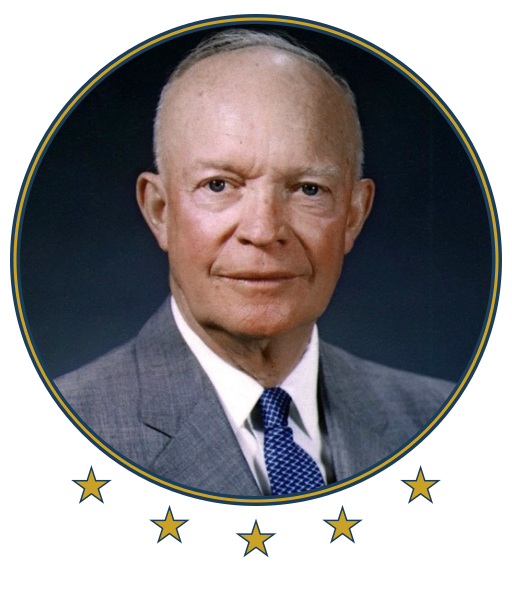

<p align="center">
  
</p>

<h1 align="center">ike</h1>

<p align="center"><em>The Eisenhower matrix, in your terminal.</em></p>

---

An Eisenhower matrix task manager, named for the president who popularized the
method ("Ike" was his campaign-era nickname). One binary, three ways in:

- **TUI** — run `ike` for an interactive 4-quadrant matrix
- **CLI** — `ike add`, `ike done`, … for quick capture and scripting
- **MCP** — `ike mcp` serves the Model Context Protocol so AI agents can manage your matrix

All three share a single JSON data file, safe against concurrent writes.

## The matrix

| | Urgent | Not urgent |
|---|---|---|
| **Important** | 1 · Do It First | 2 · Schedule It |
| **Not important** | 3 · Delegate It | 4 · Consider Eliminating It |

Those headings are defaults, not fixed: rename any quadrant with `t` in the TUI
or `ike label`. The quadrant *numbers* never change, so scripts and the MCP
tools keep working whatever you call them.

## Install

Requires Go 1.24+.

```sh
go install github.com/jonascript/ike@latest
```

Or from a checkout, with a stamped version:

```sh
go build -ldflags "-X github.com/jonascript/ike/internal/cli.version=$(git describe --tags --always)" -o ike .
```

## TUI

Run `ike` with no arguments.

| Key | Action |
|---|---|
| `1`–`4`, `tab` / `shift+tab` | focus quadrant |
| `j`/`k` or `↑`/`↓` | select task |
| `J`/`K` or `shift+↑`/`shift+↓` | move task down/up within its quadrant |
| `a` | add task to focused quadrant |
| `e` | edit task title |
| `t` | rename the focused quadrant |
| `x` / `enter` | complete task (moves to archive) |
| `m` then `1`–`4` | move task to quadrant |
| `d` twice | delete task permanently |
| `u` | undo the last change |
| `U` / `ctrl+r` | redo |
| `v` | archive view (`r` there restores a task) |
| `?` | toggle help |
| `q` | quit |

Changes made by the CLI or MCP server while the TUI is open appear within ~2 seconds.

A dim `◆ mcp` marker sits in the footer while AI agent access is enabled; see
[MCP](#mcp). No marker means nothing but you can reach the matrix.

## CLI

```sh
ike add "Fix prod bug" -q 1     # quadrant 1-4; defaults to 2 (Schedule)
ike list                        # active tasks grouped by quadrant
ike list -q 1 --json            # filter + machine-readable output
ike done 3                      # complete task 3 (archives it)
ike mv 3 2                      # move task 3 to quadrant 2
ike reorder 3 up                # up | down | top | bottom, within its quadrant
ike rm 3                        # delete permanently (no archive)
ike archive                     # completed tasks, newest first
ike restore 3                   # un-archive task 3, back to its quadrant
ike undo                        # revert the last change, from any frontend
ike redo                        # re-apply the last undone change
ike label                       # show the four quadrant headings
ike label 1 "Firefighting"      # rename a quadrant
ike label 1 --reset             # restore its default name
```

## Renaming the quadrants

The default headings are *Do It First*, *Schedule It*, *Delegate It*, and
*Consider Eliminating It*. Rename any of them with `t` in the TUI or `ike label`
— up to 40 characters. Custom names are stored per data file and shared by all
three frontends; a rename is undoable like any other change.

Only the display name changes. Quadrant numbers 1–4 and their urgent/important
meanings are fixed, so `ike add -q 1`, the matrix layout, and the MCP tools are
unaffected by whatever you call them. Clearing a name (empty input, or
`--reset`) drops the override and restores the default, which also means a
future release's defaults reach you rather than being frozen at rename time.

## Undo and redo

Every change records a snapshot, so `ike undo` (or `u` in the TUI) reverts the
last one — including a delete, and including changes made from a different
frontend. Run it repeatedly to walk further back; the last 20 changes are kept
in the data file, so history survives restarts. Undo does not recycle task IDs.

`ike redo` (or `U` / `ctrl+r`) re-applies what you just undid, and is itself
undoable. **Any new change discards the redo history** — that includes a change
made from another frontend, so an MCP agent writing while your TUI is open will
clear a redo you were holding. The alternative is replaying a snapshot from a
branch you've diverged from, which would silently clobber the newer change. The
TUI only shows the redo hint while a redo is actually available.

## MCP

**Agent access is off by default.** A fresh install will not serve your tasks to
anything until you say so, and registering ike with an MCP client is not enough
on its own — `ike mcp` refuses to start while access is off:

```sh
ike mcp enable      # allow AI agents to read and manage this matrix
ike mcp disable     # revoke it
ike mcp status      # show the current setting and which data file it applies to
```

The setting is remembered in the data file, so it survives restarts and
upgrades, and it is scoped to that matrix: enabling access for your personal
tasks does not enable it for a second matrix under `IKE_DATA_FILE`. It is not
part of undo history — no sequence of `ike undo` can re-open access you closed.
While access is on, the TUI shows a `◆ mcp` marker in its footer, and `?`
explains the setting either way.

Once enabled, `ike mcp` runs an MCP server on stdio with tools `list_tasks`,
`add_task`, `complete_task`, `move_task`, `reorder_task`, `update_task`,
`delete_task`, `list_archive`, `restore_task`, `undo`, `redo`, `list_quadrants`,
and `set_quadrant_label`.

Register with Claude Code:

```sh
ike mcp enable
claude mcp add ike -- ike mcp
```

Or in any MCP client config:

```json
{ "mcpServers": { "ike": { "command": "ike", "args": ["mcp"] } } }
```

## Data

Tasks live in `$XDG_DATA_HOME/ike/tasks.json` (default
`~/.local/share/ike/tasks.json`). Override with `IKE_DATA_FILE`. Writes are
atomic and serialized through a lock file, so the TUI, CLI, and MCP server can
run at the same time without losing updates.

Linux and macOS are supported; Windows is untested (path resolution assumes
XDG conventions).

## License

[MIT](LICENSE)

---

*Logo based on Eisenhower's official White House portrait (May 29, 1959), a
U.S. government work in the public domain.*
